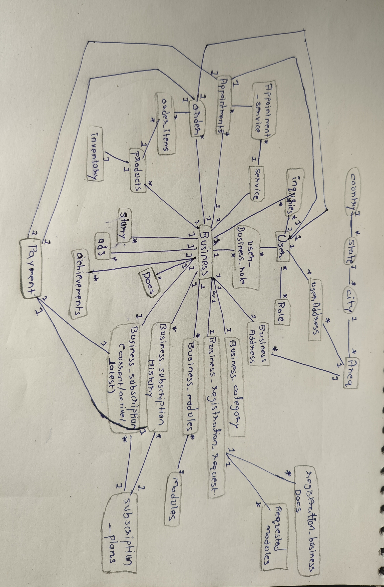

## Final Entity and Relationships

### Changes

### Location Hierarchy

The platform will maintain the following location hierarchy:

```text
 Country
    ↓
  State
    ↓
   City
    ↓
   Area
```

Although the current platform primarily operates at the City and Area level, Country and State have been retained in the model for future scalability.

This decision supports:

* Expansion into multiple countries
* Future regulatory requirements
* Improved geographical analytics

---

### Subscription Architecture

The subscription model has been finalized as follows.

#### Active Subscriptions

```text
Business
    1 ---- * BusinessSubscription

SubscriptionPlan
    1 ---- * BusinessSubscription
```

BusinessSubscription represents currently active subscriptions.

---

#### Subscription History

```text
Business
    1 ---- * BusinessSubscriptionHistory

SubscriptionPlan
    1 ---- * BusinessSubscriptionHistory
```

BusinessSubscriptionHistory represents historical subscription records and renewal history.

This separation allows active subscriptions and historical subscription data to be managed independently.

---

## Final Entities

### Identity Domain

* User
* SystemAdmin
* Role
* UserAddress

---

### Location Domain

* Country
* State
* City
* Area

---

### Business Domain

* Business
* BusinessCategory
* BusinessAddress
* BusinessRegistrationRequest
* BusinessRegistrationDocument
* BusinessRegistrationRequestedModules
* BusinessDocument
* BusinessRole

---

### Subscription Domain

* SubscriptionPlan
* BusinessSubscription
* BusinessSubscriptionHistory

---

### Module Domain

* Module
* BusinessModule

---

### Product Commerce Domain

* Product
* Inventory
* ProductOrder
* OrderItem

---

### Service Domain

* Service
* Appointment

---

### Marketing Domain

* Story
* Advertisement
* Achievement

---

### Communication Domain

* Inquiry

---

### Payment Domain

* Payment

---

## Relationship Entities

* UserRole
* BusinessRole
* BusinessModule
* OrderItem

---

## Final Relationships

### User ↔ Role

Many-to-Many

Implemented Through:
UserRole

---

### User ↔ UserAddress

One-to-Many

---

### Country ↔ State

One-to-Many

---

### State ↔ City

One-to-Many

---

### City ↔ Area

One-to-Many

---

### Area ↔ UserAddress

One-to-Many

---

### Area ↔ BusinessAddress

One-to-Many

---

### User ↔ Business

Many-to-Many

Implemented Through:
BusinessRole

---

### BusinessCategory ↔ Business

One-to-Many

---

### User ↔ BusinessRegistrationRequest

One-to-Many

---

### BusinessRegistrationRequest ↔ Business

One-to-One

---

### BusinessRegistrationRequest ↔ BusinessRegistrationDocument

One-to-Many

---

### BusinessRegistrationRequest ↔ BusinessRegistrationRequestedModules

One-to-Many

---

### Module ↔ BusinessRegistrationRequestedModules

One-to-Many

---

### Business ↔ BusinessDocument

One-to-Many

---

### Business ↔ BusinessAddress

One-to-One

---

### Business ↔ Module

Many-to-Many

Implemented Through:
BusinessModule

---

### Business ↔ BusinessSubscription

One-to-Many

---

### SubscriptionPlan ↔ BusinessSubscription

One-to-Many

---

### Business ↔ BusinessSubscriptionHistory

One-to-Many

---

### SubscriptionPlan ↔ BusinessSubscriptionHistory

One-to-Many

---

### Payment ↔ BusinessSubscription

One-to-One

---

### Payment ↔ BusinessSubscriptionHistory

One-to-One

---

### Business ↔ Product

One-to-Many

---

### Product ↔ Inventory

One-to-One

---

### User ↔ ProductOrder

One-to-Many

---

### Business ↔ ProductOrder

One-to-Many

---

### Payment ↔ ProductOrder

One-to-One

---

### ProductOrder ↔ Product

Many-to-Many

Implemented Through:
OrderItem

---

### Business ↔ Service

One-to-Many

---

### User ↔ Appointment

One-to-Many

---

### Business ↔ Appointment

One-to-Many

---

### Service ↔ Appointment

One-to-Many

---

### Payment ↔ Appointment

One-to-One

---

### Business ↔ Story

One-to-Many

---

### Business ↔ Advertisement

One-to-Many

---

### Business ↔ Achievement

One-to-Many

---

### User ↔ Inquiry

One-to-Many

---

### Business ↔ Inquiry

One-to-Many

---

### ER - scratch



---

## Next Step

Attribute Identification and Detailed Schema Design.
